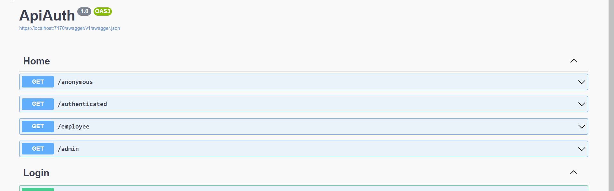

# Autenticação e Autorização com JWT

> 🚀 Projeto desenvolvido em ASP.NET Core, com objetivo de implementar utilização de Tokens para autentição e autorização com [JWT](https://jwt.io/).

  <a href="#-tecnologias-e-pacotes">Tecnologias e Pacotes</a>&nbsp;&nbsp;&nbsp;|&nbsp;&nbsp;&nbsp;
  <a href="#-autor">Autor</a>&nbsp;&nbsp;&nbsp;|&nbsp;&nbsp;&nbsp;
  <a href="#-contribuição">Contribuição</a>&nbsp;&nbsp;&nbsp;|&nbsp;&nbsp;&nbsp;
  <a href="#-licença">Licença</a>

### Api-Auth-Jwt 🚀

### 🛠 Tecnologias e Pacotes

As seguintes ferramentas foram usadas na construção do projeto:

- [.NET6](https://visualstudio.microsoft.com/pt-br/vs/community/)
- [Microsoft.AspNetCore.Authentication.Core](https://www.nuget.org/packages/Microsoft.AspNetCore.Authentication.Core)
- [Microsoft.AspNetCore.Authentication.JwtBearer](https://www.nuget.org/packages/Microsoft.AspNetCore.Authentication.JwtBearer)

### 😎 Autor

Guilherme Ferrari - guile.ferrari@hotmail.com

### 🎯 Contribuição

1. Faça o _fork_ do projeto
2. Crie uma _branch_ para sua modificação (`git checkout -b feature/descricaoFeature`)
3. Faça o _commit_ (`git commit -am 'Add descricaoFeature'`)
4. _Push_ (`git push origin feature/descricaoFeature`)
5. Crie um novo _Pull Request_

### 📝 Licença

MIT.